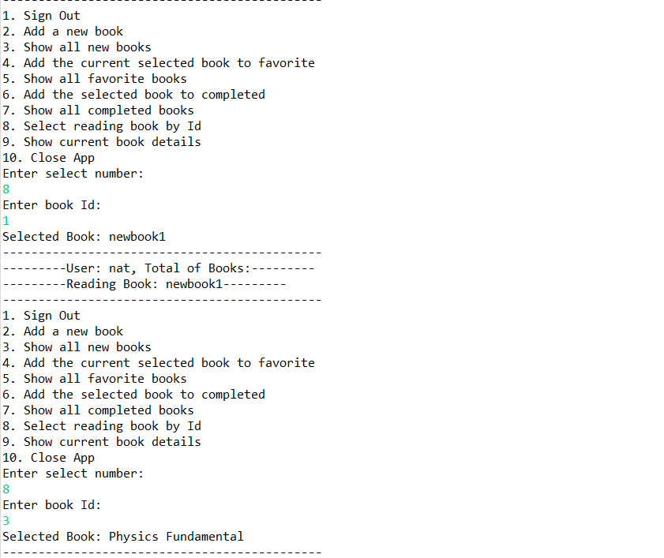
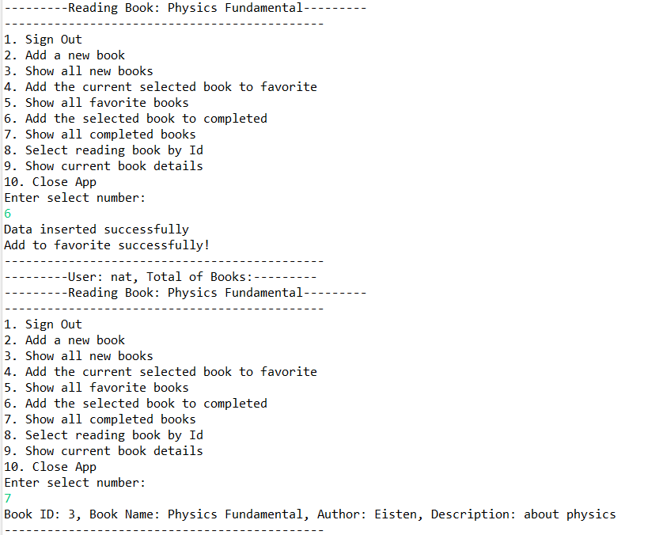
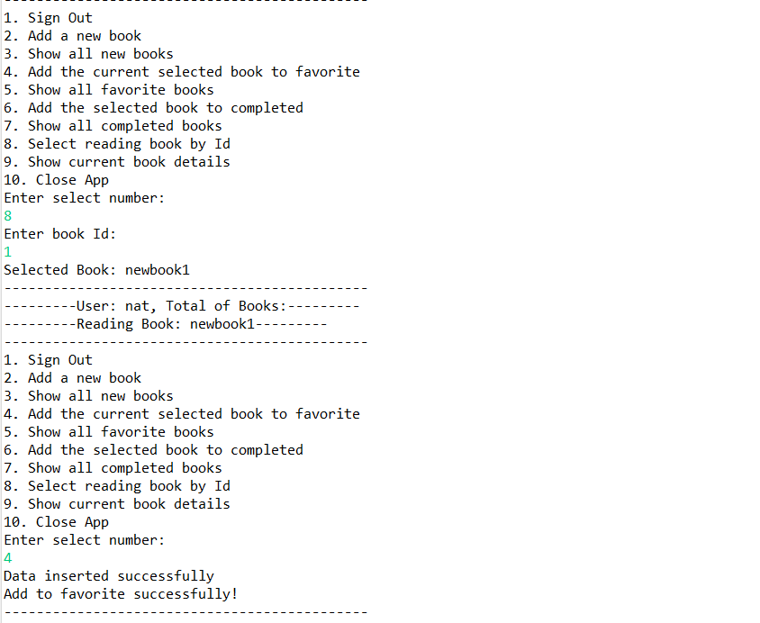

# Magic-Of-Books-Core-Java

Magic of Books is a Book store which deals with book. All the inventory of the store is been 
managed manually. Now as store is expending it is becoming difficult to manage it manually. 
Books store wants to have a book management system with following feature.

## User Stories:
1. As an User, I should be able to enter into the application using my user name
2. As an User, My user name should be checked and verified
3. As an User, if valid I should be able to see all my books (new, Favourite or 
completed)
4. As a User, I should be able to select any book by entering book Id.
5. As a User, I should be able to get book details like Author name and description.

## Instructions:

1. The User class should have following Attributes:

| Property  | Type | Description |
| ------------- | ------------- | -------------|
| username | String  | unique name of the user |
| email | String | stores user email address |
| password  | String  | stores user's password |
 
The book class should have following attributes:

| Property  | Type | Description |
| ------------- | ------------- | -------------|
| bookId | int  | unique id for the book |
| bookName | String  | store the name of the book |
| author | String  | store the name of the author |
| description | String  | Book's description |

 
2. Use Arrays to store books information in user class.
3. Create book and User as a pojo.
4. Create MagicOfBooks class to define all the functionality related methods. 
5. Use recursive menu to display all the options and inputs
6. Zero marks will be awarded if the code throws compile time error. Partial marking will be done only if the code has no compile time error

## Database Schema

CREATE TABLE users(username VARCHAR(30) NOT NULL, email VARCHAR(30), password VARCHAR(30), PRIMARY KEY (username));

CREATE TABLE books(bookid INT NOT NULL AUTO_INCREMENT PRIMARY KEY, bookname VARCHAR(30), author VARCHAR(30), description VARCHAR(255));

CREATE TABLE favorites(no INT NOT NULL AUTO_INCREMENT, username varchar(30) NOT NULL, bookid INT NOT NULL, Primary Key (no), INDEX (username), INDEX (bookid), FOREIGN KEY (username) REFERENCES users(username), FOREIGN KEY (bookid) REFERENCES books(bookid));

CREATE TABLE completed(no INT NOT NULL AUTO_INCREMENT, username varchar(30) NOT NULL, bookid INT NOT NULL, Primary Key (no), INDEX (username), INDEX (bookid), FOREIGN KEY (username) REFERENCES users(username), FOREIGN KEY (bookid) REFERENCES books(bookid));

ALTER TABLE favorites ADD UNIQUE KEY uk_userbook (username, bookid);

ALTER TABLE completed ADD UNIQUE KEY uk_userbook (username, bookid);

| Field    | Type        | Null | Key | Default | Extra |
| ------------- | ------------- | ------------- | ------------- | ------------- | ------------- |
| username | varchar(30) | NO   | PRI | NULL    |       |
| email    | varchar(30) | YES  |     | NULL    |       |
| password | varchar(30) | YES  |     | NULL    |       |

| Field       | Type         | Null | Key | Default | Extra          |
| ------------- | ------------- | ------------- | ------------- | ------------- | ------------- |
| bookid      | int          | NO   | PRI | NULL    | auto_increment |
| bookname    | varchar(30)  | YES  |     | NULL    |                |
| author      | varchar(30)  | YES  |     | NULL    |                |
| description | varchar(255) | YES  |     | NULL    |                |

favorite table

| Field    | Type        | Null | Key | Default | Extra          |
| ------------- | ------------- | ------------- | ------------- | ------------- | ------------- |
| no       | int         | NO   | PRI | NULL    | auto_increment |
| username | varchar(30) | NO   | MUL | NULL    |                |
| bookid   | int         | NO   | MUL | NULL    |                |

completed table

| Field | Type | Null | Key | Default | Extra |
| ------------- | ------------- | ------------- | ------------- | ------------- | ------------- |
| no | int | NO | PRI | NULL | auto_increment |
| username | varchar(30) | NO   | MUL | NULL |  |
| bookid   | int | NO | MUL | NULL |  |

## Output

